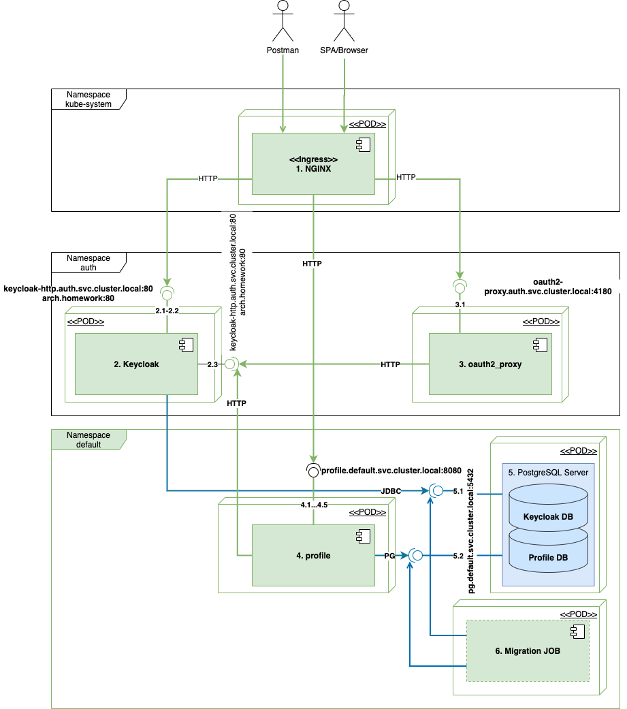

* [Архитектура](#Архитектура)
* [Инструкция по установке](#Инструкция-по-установке)
* [Описание тестовых сценариев](#Описание-тестовых-сценариев)

# Otus 2.11 

## Архитектура

### Deployment diagram ###



**Описание сервисов и интерфейсов**
| № | Серивис | № | Интерфейс | Потребители |Описание интерфейса |
|---|---------|---|-----------|-------------|--------------------|
|1|ingress(NGINX)|1.1|arch.homework/auth/|Postman, SPA, Browser|Точка доступа к keycloak для администрирования и получения токенов|
|1|ingress(NGINX)|1.2|arch.homework/profile/api/v1/|Postman, SPA|Точка доступа к сервису упревления портфелями profile.default.svc.cluster.local:8080|
|2|Keycloak|2.1|POST /auth/realms/master/protocol/openid-connect/token|Postman, oauth2_proxy|REST API Получение токена пользователя keycloak (implicit flow для posman, code flow  для oauth2_proxy)|
|2|Keycloak|2.2|POST /auth/admin/realms/portfolio/users|Postman|REST API регистрации нового пользователя|
|2|Keycloak|2.3|GET /auth/realms/portfolio|profile, oauth2_proxy|Сервис получения конфигурации  OpenID Connet клиента|
|3|oauth2_proxy|3.1|GET /oauth2/auth|ingress(NGINX)|Сервис проверки  JWT  токена или получения JWT токена по сессии oauth2_proxy|
|4|profile|4.1|GET /login|Postman, SPA|Получение данных о пользователе по его токену или сессии oauth2_proxy|
|4|profile|4.1-4.5|GET /portfolios<br/>GET /portfolios/{id}<br/>POST /portfolios<br/>PUT /portfolios/{id}|Postman, SPA|CRUD для работы с портфелями|
|5|pg|5.1|postgres://keycloak:otus-pg.default.svc.cluster.local:5432/keycloak?sslmode=disable|Keycloak|PostgreSQL БД для Keycloak|
|5|pg|5.2|postgres://profile:otus-pg.default.svc.cluster.local:5432/profile?sslmode=disable|profile|PostgreSQL БД для profile|
|6|migration||||Джобы миграции БД|

### Интеграционные сценарии ###

**Целевая авторизация для Single Page Application (code flow)**


1. Клинет открывает SPA по ссылке arch.homework, SPA загружается в барузер с сервера статических ресурсов
2. SPA пытается получить данные о пользователе из сервиса profile, запрос проходит через Ingress, который пытается получить токен из oauth2_proxy
    1. Если запрос содержит сессионную cookie _oauth2_proxy, то oauth2_proxy возвращает в Ingress access_token
        1. Запрос данных о пользователе проксируется в сервис profile c Authorizaion: Bearer: access_token
        2. Сервис profile проверяет подпись токена, достает из него информацию о пользователе и возвращает ее в JSON формате в SPA
    2. Если сессионной куки нет или она не валидна, oauth2_proxy возвращает 302 REDIRECT на страницу ввода логина и пароля keycloak
        1. Пользователь авторизуется в keycloak, и keycloak редиректит его на callback URL oauth2_proxy, с публичным code
        2. oauth2_proxy обменивает code на токены
        3. ouath2_proxy создает сессионную cookie, запоминает токены в своей сессии и делает 302 REDIRECT на главную страницу SPA
        4. GO TO 2.
 


**Тестовый сценарий для Postman (implicit flow)**


**Работа с портфелем**
Сценарии использования описаны в swagger спецификации: 

## Инструкция по установке

### Пререквизиты

1. Должен быть установлен ingress

```
minikube addons enable ingress
```

2. Необходимо склонировать данный репозиторий и открыть папку otus2.11 со всеми необходимыми файлами для настройки сервисов

```
git clone git@github.com:WWTLF/otus.git
cd otus2.11
```

### Шаг 1. Устновка главного приложения из HELM

```
helm repo add wwtlf2 https://wwtlf.github.io/portfolio-chart/
helm repo update
helm install otus wwtlf2/portfolio-chart
```

### Шаг 2. Устновка keycloak

```
kubectl create namespace auth
helm repo add codecentric https://codecentric.github.io/helm-charts
helm repo update
helm install keycloak codecentric/keycloak -f keycloak-values.yaml -n auth --version "9.5.0"
```
*9.5.0 - необходимо использовать более старую версию, так как в новой баг с обратной совместимостью манифеста ingress*

*HELM главного приложения несет с собой БД для keycloak с настроенной конфигурацией*

*Если имя релиза главного приложения отличается от otus, то необходимо указать правильно ссылку на БД в файле keycloak-valyues.yaml*
```
- name: DB_ADDR
    value: otus-pg.default.svc.cluster.local
```
Сервисы keycloak и главного приложения делят один сервер БД, но разные инстансы БД. 


**Шаг 2.1 Настройка CoreDNS:**

Стандарт OIDC требует, чтобы хост получения токена совпадал с хостом получения ключей для проверки подписи токена. Поэтому доступ к keycloak, как через Ingress, так и через Service(ClusterIP) должен идти по хосту arch.homework. В k8s нет стандартного ресурса для добавления host alias к сервису (можно только к IP, но это не гибко), но можно добавить DNS правило для CoreDNS Controller. 

```
kubectl apply -f coredns-configmap.yaml
# Перезапускаем coredns
kubectl get pods -n kube-system | grep coredns
coredns-f9fd979d6-j5z4c        1/1     Running   0          45m
# Указываем правильный POD coredsn-...
kubectl delete pod coredns-f9fd979d6-j5z4c -n kube-system
```

*(FYI) Содержимое файла coredns-configmap.yaml:*
```
apiVersion: v1
data:
  Corefile: |
    .:53 {
        errors
        health {
           lameduck 5s
        }
        ready
        kubernetes cluster.local in-addr.arpa ip6.arpa {
           pods insecure
           fallthrough in-addr.arpa ip6.arpa
           ttl 30
        }
        rewrite name arch.homework keycloak-http.auth.svc.cluster.local //ВАЖНО! Правильно указать внешний хост и FQDN сервиса Keycloak
        prometheus :9153
        forward . /etc/resolv.conf {
           max_concurrent 1000
        }
        cache 30
        loop
        reload
        loadbalance
    }
kind: ConfigMap
metadata:
  name: coredns
  namespace: kube-system
  
```

### Шаг 3. Устновка oauth2_proxy

```
kubectl apply -f oauth2-deployment.yaml
```
