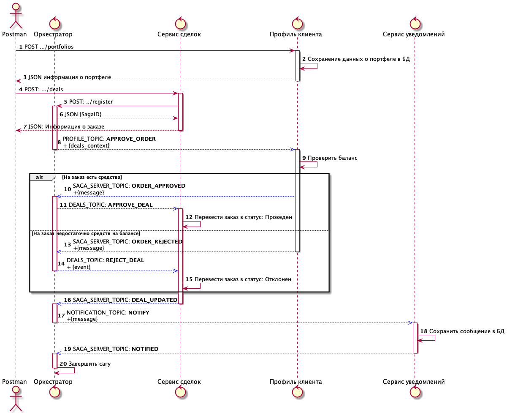

# Архитектура


## Описание сервисов 
| № | Сервис | Описание |Namespace установки|
|---|--------|----------|-------------------|
|1|nginx(ingress)| Точка входа в кластер k8s для потребителей проекта|kube-system|
|2|keycloak| Open ID Conntect Provider авторизации|auth|
|3|oauth2_proxy| Фильтр аутентификации|auth|
|4|profile|Сервис ведения профиля клиента, его инвестиционных портфелей и снимков состояний портфелей по датам (историческая позиция)|default|
|5|PostgreSQL|Коммунальный сервер БД, где для каждого потребителя приходится по однойы отдельной БД PostgreSQL|default|
|6|Migration|Набор джобов миграции БД, для каждой БД при раскатке создается и выполняется отдельный JOB миграции|default|
|7|Deals|Сервис ведения сделок(заказов) клиента. Снимок состояния портфеля в сервисе profile ведется по сделкам, которые ведутся в данном сервисе. |default|
|8|notification|Сервис "заглушка" для рассылки уведомлений. В целевом виде предполагается интеграция с шлюзом событий Google|default|
|9|saga-machine|Оркестратор асинхронных бизнес-сценариев (сага)|default|
|12|Kafka|Брокер Kafka|integreation|
|13|ZooKeeper|ZooKeeper|integreation|
## Описание интерфейсов
| № | Сервис | № | Интерфейс | Потребители |Описание интерфейса |API Spec|
|---|--------|---|-----------|-------------|--------------------|--------|
|1|ingress(NGINX)|1.1|arch.homework/auth/|Postman, SPA, Browser|Точка доступа к keycloak для администрирования и получения токенов||
|1|ingress(NGINX)|1.2|arch.homework/profile/api/v1/|Postman, SPA|Точка доступа к сервису управления портфелями profile.default.svc.cluster.local:8080||
|2|Keycloak|2.1|POST /auth/realms/master/protocol/openid-connect/token|Postman, oauth2_proxy|REST API Получение токена пользователя keycloak (implicit flow для posman, code flow  для oauth2_proxy)||
|2|Keycloak|2.2|POST /auth/admin/realms/portfolio/users|Postman|REST API регистрации нового пользователя||
|2|Keycloak|2.3|GET /auth/realms/portfolio|profile<br/>oauth2_proxy</br>deals|Сервис получения конфигурации  OpenID Connet клиента||
|3|oauth2_proxy|3.1|GET /oauth2/auth|ingress(NGINX)|Сервис проверки  JWT  токена или получения JWT токена по сессии oauth2_proxy||
|4|profile|4.1|GET /login|Postman, SPA|Получение данных о пользователе по его токену или сессии oauth2_proxy|[спецификация](https://gitlab.com/portfolio_counselor/profile-src/-/blob/master/profile.yaml)|
|4|profile|4.2-4.5|GET /portfolios<br/>GET /portfolios/{id}<br/>POST /portfolios<br/>PUT /portfolios/{id}|Postman, SPA|CRUD для работы с портфелями|[спецификация](https://gitlab.com/portfolio_counselor/profile-src/-/blob/master/profile.yaml)|
|4|profile|4.6|KAFKA Topic: PROFILE_TOPIC|saga-machine|Топик приема команды на одобрение сделки|Сущность: deal_context<br/>[спецификация](https://gitlab.com/)|
|5|pg|5.1|postgres://keycloak:otus-pg.default.svc.cluster.local:5432/keycloak?sslmode=disable|Keycloak|PostgreSQL БД для Keycloak||
|5|pg|5.2|postgres://profile:otus-pg.default.svc.cluster.local:5432/profile?sslmode=disable|profile|PostgreSQL БД для profile||
|5|pg|5.3|postgres://deals:otus-pg.default.svc.cluster.local:5432/deals?sslmode=disable|deals|PostgreSQL БД для deals||
|5|pg|5.4|postgres://stock:otus-pg.default.svc.cluster.local:5432/stock?sslmode=disable|stock|PostgreSQL БД для stock||
|5|pg|5.5|postgres://notifications:otus-pg.default.svc.cluster.local:5432/notifications?sslmode=disable|notifications|PostgreSQL БД для stock||
|5|pg|5.6|postgres://saga:otus-pg.default.svc.cluster.local:5432/saga?sslmode=disable|saga-machine|PostgreSQL БД для saga-machine||
|6|migration||||Джобы миграции БД||
|7|deals|7.1|POST /deals|SPA, Postman|CRUD сервисы работы со сделкамми|[спецификация](https://gitlab.com/portfolio_counselor/deals-src/-/blob/master/deals.yaml)|
|7|deals|7.2|KAFKA Topic: DEALS_TOPIC|saga-machine|Топик для приема команд по одобрению сделок|Сущность: deal_context<br/>[спецификация](https://gitlab.com/portfolio_counselor/deals-src/-/blob/master/deals.yaml)|
|8|notifications|8.1|KAFKA Topic:  NOTIFICATION_TOPIC|saga-machine|Топик для приема команд по отправке уведомлений|Сущность: notoficationDTO<br/>[спецификация](https://gitlab.com/portfolio_counselor/notification/-/blob/master/notification.yaml)|
|9|notifications|9.1|KAFKA Topic:  SAGA_SERVER_POIC|profile<be/>deals<br/>notification|Топик получения событий от участников саги|Сущность: Event<br/>[спецификация](https://gitlab.com/portfolio_counselor/saga-machine-src/-/blob/master/saga.yaml)|

## Функциональные требования и пользовательские истории ##

### US 1. Я как клиент, хочу вести свои инвестиционные портфели, и иметь возможность получать аналитику по ним

Сервисы 4.1-4.5 Реализуют CRUD интерфейс работы с портфелем. 

Клиент задает: 
 - Способ оптимизации портфеля (минимальный риск, максимальная доходность, максимальный коэф. Шарпа)
 - Сумму предполагаемых инвестиций
 - Срок инвестиций

#### FR 1.1. Ведение исторической позиции
TODO

### US 2. Я как клиент, хочу управлять составом инвестиционного портфеля посредствам добавления информации о заключенных сделках на бирже

Клиент задает позиции сделок:
 - код ценной бумаги или инструмента
 - цену покупки или продажи
 - комиссию брокера
 - тип сделки: покупка или продажа


### US 3. Я как клиент, хочу чтобы после создания мной информации о действиях на бирже (создание сделок), информация о моей исторической позиции обновилась в портфеле и я получил уведомление
Процесс реализуется с помощью оркестратора по паттерну SAGA. Архитектурное описание самого сервиса оркестрации описано в ДЗ по паттерну SAGA.

#### FR 3.1 Статусная машина  MANUAL_CREATE_OREDER (Ручное создание сделки)


**Описание переходов**
|Сервис<br/>источник события|Событие от сервиса|Исходное состояние|Следующее состояние|Сервис<br/>получатель команды|Команда сервису|Описание|
|----------------|------------------|------------------|-------------------|------------------------------|---------------|--------|
|Deals|REGISTER|-|DRAFT|Profile|APPROVE_OREDER|Сервис сделок регистрирует новую сагу по ручной регистрации сделки|
|Profile|OREDER_APPROVED|DRAFT|APPROVED|Deals|APPROVE_DEAL|Сервис профиля клиента проверяет баланс, одобряет сделку, обновляет состояние портфеля, и возвращает управление оркестратору событием OREDER_APPROVED|
|Profile|OREDER_REJECTED|DRAFT|REJECTED|Deals|REJECT_DEAL|Сервис профиля клиента проверят баланс и отклоняет сделку, и возвращает управление оркестратору событием OREDER_REJECTED|
|Deals|DEAL_UPDATED|PPROVED или REJECTED|NOTIFICATION|notification|NOTIFY|Сервис сделок обновляет информация о сделке, меняет ее статус черновика на Исполнена или Отклонена, и возвращает управление оркестратру командой NOTIFY|
|nottification|NOTIFIED|NOTIFICATION|FINISHED|-|-|Сервис уведомлений фиксирует сообщение в БД для адресата, возвращает управление оркестратору, сага завершается|

#### FR 3.2 Описание шагов сценария ручного создания сделки


**Шаги сценария**

|Номера шагов|Описание шагов|Параметры запросов и ответов|Требования|
|------------|--------------|----------------------------|----------|
|1-3|Клиент создает пустой инвестиционный портфель|Запрос:<br/>Описание по схеме  POST /portfilios [спецификация](https://gitlab.com/portfolio_counselor/profile-src/-/blob/master/profile.yaml)<br/>Ответ: id  портфеля + параметры из запроса|US 1.|
|4-7|Клиент создает черновик сделки для портфеля из шага 3|Запрос:<br/>Описание по схеме  POST /deals [спецификация](https://gitlab.com/portfolio_counselor/profile-src/-/blob/master/profile.yaml)<br/>Ответ: id  сделки + параметры из запроса|US 2|
|5-6|Сервис сделок регистрирует новый экземпляр саги|Запрос:<br/> POST /register [спецификация](https://gitlab.com/portfolio_counselor/saga-machine-src/-/blob/master/saga.yaml)<br/>Ответ: id саги|Будет описано в ДЗ по САГА|
|8|Оркестратор отпрвляет асинхронный запрос в PROFILE_TOPIC|Команда APPROVE_ORDER, контекст команды deals_context, [спецификация](https://gitlab.com/portfolio_counselor/deals-src/-/blob/master/deals.yaml)||
|9|Сервис ведения портфеля проверяет баланс ||FR 3.3|
|10|Если проверка баланса прошла успешно, сервис профиля генерирует событие OREDER_APPROVED |Событие OREDER_APPROVED, контекст   события error, [спецификация](https://gitlab.com/portfolio_counselor/profile-src/-/blob/master/profile.yaml)|FR 3.3|
|11|Оркестратор  дает команду сервису сделок сменить статус сделки на проведена|Команда APPROVE_DEAL, контекст команды deals_context, [спецификация](https://gitlab.com/portfolio_counselor/deals-src/-/blob/master/deals.yaml)||
|12|Сервис ведения сделок переводит сделку в статус проведена||FR 3.4|
|13|Если проверка баланса прошла успешно, сервис профиля генерирует событие OREDER_REJECTED |Событие OREDER_REJECTED, контекст   события error, [спецификация](https://gitlab.com/portfolio_counselor/profile-src/-/blob/master/profile.yaml)|FR 3.3|
|14|Оркестратор  дает команду сервису сделок сменить статус сделки на отклонена|Команда REJECT_DEAL, контекст команды deals_context, [спецификация](https://gitlab.com/portfolio_counselor/deals-src/-/blob/master/deals.yaml)||
|15|Сервис ведения сделок переводит сделку в статус отклонена||FR 3.4|
|16|Сервис сделки возвращает управление оркестратору событием Событие OREDER_REJECTED|||
|17|Оркестратор дает команду на уведомление клиенту NOTIFY|Команда NOTIFY, контекст   события error, [спецификация](https://gitlab.com/portfolio_counselor/profile-src/-/blob/master/profile.yaml)|FR 3.5|

#### FR 3.3 Обновление исторической позиции

1. Сервис вычисляет суммарную стоимость всех позиций по сделке из deals_context включая комиссию
2. Сервис ведения портфеля проверяет остаток свободных для инвестирования средств по таблице potrfolios полю free_amount
    1. Если средств достаточно:
        1. Историческая позиция обновляется, free_amount уменьшается, invested_amount увеличивается на суммарную стоимость по сделкам
        2. Сервис отправляет событие в оркестратор: OREDER_APPROVED
    2. Если средств недостаточно:
        1. Сервис отправляет событие в оркестратор: OREDER_REJECTED

##### FR 3.3.1 Сообщение, передаваемое пользователю через сервис нотификации

1. При отправке события в оркестратор, сервис профиля заполняет контекст событие структурой [error](https://gitlab.com/portfolio_counselor/profile-src/-/blob/master/profile.yaml)[спецификация](https://gitlab.com/portfolio_counselor/profile-src/-/blob/master/profile.yaml)
2. Поле sub заполняется идентификатором авторизованного клиента  
3. Поле code заполняется кодом 200 в случае успеха и кодом 400 в случае отказа в проведении сделки
4. Поле message заполняется сообщением для клиента

#### FR 3.4 Обновление статуса сделки

1. Оркестратор  дает команду сервису сделок сменить статус сделки на проведена или отклонена командой APPROVE_DEAL и REJECT_DEAL соответственно.
    1. Идентификатор сделки передается в deal_context
2. Статус сделке обновляется в таблице deals.
3. Сервис сделок отправляет  событие в оркестратор DEALS_UPDATED

#### FR 3.5 Уведомление лкиента

1. Оркестратор отправляет команду NOTIFY в NOTIFICATION_TOPIC
2. Сервис уведомлений сохраняет сообщение в таблицу notifications
3. Сервис уведомлений отправляет событие NOTIFIED оркестратору. 


## Нефункциональные требования ##

### NFR 1. Требования по информационной безопасности

#### NFR 1.1 Авторизация
Требования описаны тут: https://github.com/WWTLF/otus/tree/master/otus2.11

### NFR2. Оркестратор

Архитектура будет описана в ДЗ по SAGA.

1. Оркестратор обменивается командами и событиями по выделенным на каждый сервис топикам в формате JSON в структуре [Event](https://gitlab.com/portfolio_counselor/saga-machine-src/-/blob/master/saga.yaml)
    1. Каждый сервис может передавать произвольный контекст в событии. 
    2. Каждая команда содержит набор всех контекстов от всех сервисов участников саги. 
2. Оркестратор в своей реализации имеет аккумулятор в БД, который используется для обмена контекстами. 


# Инструкция по установке

Проект развернут в облаке digitalocean под доменом http://risqless.io. (Minikube после установки kafka не тянет :( )

Для доступа необходимо:
1. Установить утилиту doctl

```
brew install doctl
```

2. Авторизоваться в проекте по секретному токену (будет передан через чат проверки ДЗ)

```
doctl auth init
```

Далее ввести токен

3. Получить список контекстов для kubctl

```
kubectl config get-contexts

do-ams3-boris109   do-ams3-boris109   do-ams3-boris109-admin
```

4. Переключиться на контекст проекта

```
kubectl config use-context do-ams3-boris109

Switched to context "do-ams3-boris109".
```

Далее можно работать через kubectl

# Инструкция по запуску теста

```
newman run otus2.15-boris_ershov.postman_collection.json --delay-request 20000
```
Задержка в 20000 мс нужна, чтобы успела отработать SAGA. Если количество подов увеличить, можно ускориться. 
